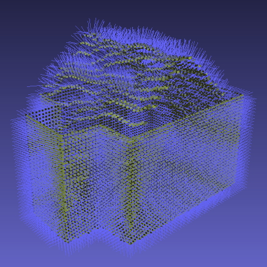

# 3D roof and building reconstruction using photogrammetric DSM

This project contains sample Bash and Python scripts along with C++ CGAL executables which perform the following tasks:
* Download [IGNF](https://www.ign.fr/institut/identity-card) [DSM](https://geoservices.ign.fr/actualites/2020-12-10-MNT-MNS) and [BDTOPO](https://geoservices.ign.fr/documentation/donnees/vecteur/bdtopo) building footprint for a given IGNF building identifier
* Crop DSM using BDTOPO footprint (including an optional buffer)
* Transform DSM extract into a point cloud or a mesh supporting different options: normals calculation, walls and floor creation using [BDTOPO](https://geoservices.ign.fr/documentation/donnees/vecteur/bdtopo), axis reordering, local reference coordinates
* Run different CGAL components in order to detect and reconstruct roof panels or building. Among them:
    * [Efficient RANSAC](https://doc.cgal.org/latest/Shape_detection/index.html#title1)
    * [Region Growing](https://doc.cgal.org/latest/Shape_detection/index.html#title10)
    * [Edge Collapse](https://doc.cgal.org/latest/Surface_mesh_simplification/index.html)
    * [Polygonal Surface Reconstruction](https://doc.cgal.org/latest/Polygonal_surface_reconstruction/index.html)

## Building this project

First clone this project

```shell
git clone https://github.com/ignfab/building-roof-pipeline.git
```

The prefered solution for running the Python scripts is `venv`.

### Create venv

Create the `venv` first from the root of the project

```shell
python3 -m venv venv/roof
source venv/roof/bin/activate # will activate venv
```

### Install GDAL Python with venv

Install GDAL using apt first. Below an example for Ubuntu.

```shell
sudo add-apt-repository ppa:ubuntugis/ppa
sudo apt-get install libgdal-dev gdal-bin
```

Then install GDAL Python with venv activated

```shell
(roof) python3 -m pip install GDAL==$(gdal-config --version) --global-option=build_ext --global-option="-I/usr/include/gdal"
```

### Install Python dependencies with venv

With venv activated simply run

```shell
(roof) python3 -m pip install -r requirements.txt
```

### Build CGAL components executables

1. Install necessary dependencies using apt:

   ```shell
   sudo apt-get install gettext-base build-essential wget m4 xz-utils libssl-dev libtbb-dev libreadline-dev pkg-config liblapack-dev libgsl-dev gfortran libopenblas-dev libgsl-dev libcliquer-dev libopenmpi-dev
   ```

2. Create download and compilation scripts based on versions defined in `cpplibs_version.cfg` by using the following command:
   ```shell
   bash patch_scripts.sh
   ```
   This script copies scripts templates from `script_templates` and replace version numbers using `envsubst`.

3. Run the script responsible for downloading and compiling the C++ libraries needed for building CGAL components:
   ```shell
   bash dl_and_build_cpplibs.sh -dc
   ```
   See `bash dl_and_build_cpplibs.sh -h` for more information. The downloaded and compiled libraries are available in the `cpplibs/` directory.

4. Run the script responsible for building CGAL components:
   ```shell
   bash build_cgal_components.sh
   ``` 
   The CGAL executables are available in the `cmake-build/` directory

## Running this project

A simple Python pipeline script is provided. The following command will test import and transform of a DMS extract.

```
python3 pipeline.py
```

Under the hood, `pipeline.py` uses `.ini` file to configure steps and variables. By default `pipeline.py` uses the `default.ini` file which only performs a sample DSM download and tranformation.  
A sample `full_pipeline.ini` file is provided which contains all the possible steps and variable for the pipeline

```shell
python3 pipeline.py --file full_pipeline.ini
```

See `python3 pipeline.py --help` to get more information on how to use the pipeline.

## How it works

The `dsm_import.py` script uses [GDAL/OGR Python bindings](https://gdal.org/api/python_bindings.html) and  [shapely](https://shapely.readthedocs.io/en/stable/manual.html).  
The `dsm_transform.py` script uses numpy extensively to transform the downloaded DSM extract into a point cloud or a mesh including normals computation. The scripts uses the idea of sliding window implemented using [numpy broadcasting](https://numpy.org/doc/stable/user/basics.broadcasting.html) to create faces and vertex normals efficiently.  
The CGAL documentation provides all the necessary information to modify or add new behaviours to the `.cpp` files in `cgal_components/`.

## Examples

Original IGNF DSM cropped  


DSM converted into point cloud with normals  


DSM converted into mesh with normals  


DSM converted into point cloud with normals + walls and floor from BDTOPO  


CGAL region growing on converted DSM Mesh  


CGAL Polygonal Surface Reconstruction using DSM converted into point cloud with walls and floor  


## Contributors 

[](https://github.com/esgn)
[](https://github.com/indyteo)
